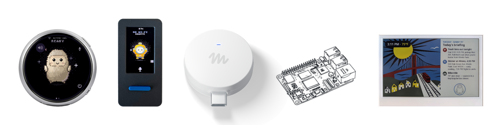

<!--
Copyright (c) Meta Platforms, Inc. and affiliates.

Licensed under the Apache License, Version 2.0 (the "License");
you may not use this file except in compliance with the License.
You may obtain a copy of the License at

    http://www.apache.org/licenses/LICENSE-2.0

Unless required by applicable law or agreed to in writing, software
distributed under the License is distributed on an "AS IS" BASIS,
WITHOUT WARRANTIES OR CONDITIONS OF ANY KIND, either express or implied.
See the License for the specific language governing permissions and
limitations under the License.
-->

# Muse Gadget SDK - ESP32 Personal AI Companion

<p align="center">
  <picture>
    <source media="(prefers-color-scheme: dark)" srcset=".github/images/muse-gadgets-dark.png">
    
  </picture>
</p>

Turn a supported ESP32 touchscreen board into a push-to-talk personal AI
companion: speak to it, hear replies, check your day, manage timers and
priorities, and answer requests from a dedicated GitHub Copilot coding session.

This fork extends the original
[Meta Muse Gadget SDK](https://github.com/facebookincubator/muse-gadget-sdk)
with **standalone OpenAI voice** and an optional **Mac/OpenClaw companion**.
The original Muse firmware and Linux SDK remain available.
**OpenAI/OpenClaw modes do not require a Muse account or the Muse app.**

**Prefer a website?** The [documentation website](website/README.md) presents
this full guide as searchable topic pages, with mobile navigation, light/dark
themes, and copyable commands. See its instructions to preview or host it.

> Experimental DIY firmware, not a finished consumer product. Flashing can
> damage devices or void warranties. Computer-control opt-ins grant real
> access to your account and files. Read the limitations and privacy sections
> before enabling them.

## Contents

- [What the project does](#what-the-project-does)
- [Choose a mode](#choose-a-mode)
- [Hardware and compatibility](#hardware-and-compatibility)
- [How it works](#how-it-works)
- [Requirements](#requirements)
- [Download and install the toolchain](#download-and-install-the-toolchain)
- [Install standalone OpenAI firmware](#install-standalone-openai-firmware)
- [Add the OpenClaw companion](#add-the-openclaw-companion)
- [Configure your personal companion](#configure-your-personal-companion)
- [Enable computer control](#enable-computer-control)
- [Optional Mac integrations](#optional-mac-integrations)
- [Set up GitHub Copilot](#set-up-github-copilot)
- [Start the bridge at login](#start-the-bridge-at-login)
- [Daily use](#daily-use)
- [Offline behavior and limitations](#offline-behavior-and-limitations)
- [Privacy, permissions, and costs](#privacy-permissions-and-costs)
- [Updates, backups, and removal](#updates-backups-and-removal)
- [Troubleshooting](#troubleshooting)
- [Development and testing](#development-and-testing)
- [Original Muse and Linux modes](#original-muse-and-linux-modes)
- [License and attribution](#license-and-attribution)

## What the project does

### Voice and on-device experience

- Push-to-talk recording, OpenAI transcription, AI responses, and generated speech.
- Animated avatar, captions, volume/mute controls, and touchscreen settings.
- Hybrid-mode Home screen with local time/date, weather, reminders or timer,
  and a daily summary or recent Copilot task.
- Local countdown timers with Dismiss, Snooze, and confirmation before replacing
  an existing timer.
- Separate OpenAI speech and OpenClaw bridge connection settings.

### Personal companion on your Mac

- Durable recent conversation context and explicitly saved personal memories.
- Reviewed **Save...** shortcuts: remember a preference, create a reminder, or
  save a local task, with retry-safe Save/Undo.
- Persistent reminders and local priorities, including complete/reopen and
  task pagination.
- Configurable morning/evening summaries and selected-calendar heads-ups.
- Preparation notes attached to one upcoming meeting occurrence.
- Configured Open-Meteo weather, without a weather API key.
- Optional incoming iMessage previews and reviewed replies.
- Optional computer/browser actions through your dedicated OpenClaw agent.

### GitHub Copilot supervision

- Questions and permission requests from a **dedicated Copilot SDK session**.
- Chimes and request-bound voice approval/denial.
- Numbered touchscreen choices and free-text dictation with explicit Send/Cancel.
- A task dashboard with progress, waiting state, results, and exact-task Stop.
- Fresh-session recovery after a bridge disconnect, without replaying old approvals.

The companion does **not** silently learn from conversations or automatically
execute saved tasks. AI models and speech recognition do not run on the ESP32.

## Choose a mode

| Mode | Voice/chat backend | Computer needed during use? | Account requirements |
|---|---|---|---|
| Standalone OpenAI | OpenAI transcription, chat, and speech | No, after USB setup; internet is still required | Billed OpenAI API access |
| OpenClaw hybrid | OpenAI speech; chat through your local OpenClaw gateway | Yes, for chat and Mac-backed features | OpenAI API access and an OpenClaw model provider |
| Hybrid + Copilot | Hybrid mode plus an independent Copilot SDK coding session | Yes, with the SDK controller running | The above plus Copilot authentication/access |
| Original Muse | Original Muse services | See the original SDK guide | Muse account/app and gadget SDK token |

Start with standalone OpenAI if you only want voice conversation.
Choose hybrid mode for personal memory, the information Home screen, reminders,
routines, and Copilot integration. You can verify the standalone voice path
first and add hybrid mode afterward without erasing Wi-Fi or API credentials.

## Hardware and compatibility

### Recommended hardware

The personal-companion deployment has been physically verified on the
**Waveshare ESP32-S3-Touch-AMOLED-1.75C**:

- ESP32-S3, 32 MB flash, 8 MB PSRAM.
- Round 1.75-inch, 466 x 466 touch AMOLED.
- Microphone, speaker, buttons, and battery support.
- USB data cable for building, flashing, and optional bench interaction.

The **Waveshare ESP32-S3-Touch-AMOLED-1.75** also has a supported OpenAI/hybrid
build profile, but uses different board settings and 16 MB flash.
It is not interchangeable with the 1.75C profile.

Other boards supported by the original Muse SDK are listed in the
[hardware guide](esp32/devices/README.md). Their original-Muse support does
**not** imply support for this fork's OpenAI/hybrid features. Those options
are currently restricted to the two Waveshare S3 1.75 profiles.
This is not an Arduino sketch for an arbitrary ESP32.

### Host compatibility

The full companion is **Mac-first**, with an Apple Silicon/Homebrew deployment
validated. ESP-IDF builds can also be performed on supported Linux hosts, but
the full Mac companion is not a turnkey Linux or Windows installation:

- EventKit calendar access and iMessage integration require macOS.
- Bonjour setup reads the Mac's `LocalHostName` through `scutil`.
- Native OpenClaw job calls currently default to `/opt/homebrew/bin/openclaw`.
- The iMessage adapter defaults to `/opt/homebrew/bin/imsg`.
- Intel Mac/non-Homebrew executable locations require adapter/path adjustments;
  putting a binary on `PATH` alone does not change those absolute defaults.

It is not tied to the author's OpenClaw instance. Other users create their
own agent, bridge identity, credentials, permissions, and settings. They do
need compatible OpenClaw configuration and RPC interfaces. The existing guide
uses the `agents.list` configuration shape from OpenClaw 2026.2.9; this is not
a guarantee for every older/newer release.

## How it works

```text
ESP32 microphone
    |
    +--> OpenAI transcription
             |
             +--> Standalone: OpenAI chat
             |
             +--> Hybrid: verified local HTTPS bridge
                              |
                              +--> loopback OpenClaw gateway / esp32 agent
                              +--> private SQLite companion state
                              +--> optional calendar / weather / Messages adapters
             |
             +--> reply text --> OpenAI speech --> ESP32 speaker

VS Code terminal: dedicated GitHub Copilot SDK session
    |
    +--> controller --> authenticated local HTTPS bridge --> ESP32 request
    +<-- exact choice / scoped voice response <--------------+
```

OpenClaw model selection is independent of the gadget's OpenAI speech key.
OpenClaw can use a compatible configured provider; the gadget's speech still
uses OpenAI. Copilot is a separate SDK integration, not an OpenClaw coding agent.

The ESP32 connects to the bridge on your trusted LAN. The OpenClaw gateway
itself stays on loopback; do not expose it or the bridge through router port
forwarding. The Mac must remain awake and reachable for Mac-backed features.

## Requirements

| Component | Requirement |
|---|---|
| Firmware toolchain | ESP-IDF **v6.0.1** |
| Board | One of the supported Waveshare S3 1.75 profiles |
| Network | 2.4 GHz Wi-Fi with internet; hybrid hosts reachable on the same trusted LAN |
| OpenAI | API key, billing enabled, and access to configured speech/chat models |
| Bridge | Python 3 and OpenSSL; bridge code uses Python's standard library |
| OpenClaw | Installed/onboarded gateway, model credentials, dedicated `esp32` agent |
| Native job support | CLI `gateway call` and gateway `chat.send`, `agent.wait`, `chat.history`, `chat.abort` |
| Copilot, optional | Node.js 22+, npm, Copilot authentication/access, SDK controller |
| Calendar, optional | macOS, Apple command-line developer tools, full EventKit access |
| Messages, optional | Signed-in Messages.app, `imsg`, relevant macOS privacy permissions |
| Normal Chrome, optional | Chrome 144+, pinned Chrome tools, explicit remote-debugging consent |

The SDK dependency is pinned to `@github/copilot-sdk` 1.0.16 and application
TypeScript to 7.0.2. Host regressions have been run with Python 3.14;
check your environment rather than assuming every runtime has been certified.
An activated ESP-IDF environment includes pyserial for USB setup.

## Download and install the toolchain

### 1. Clone the feature branch

The personal-companion features are on `feature/open-claw-with-muse`:

```sh
git clone --branch feature/open-claw-with-muse \
  https://github.com/Amal97/muse-gadget-sdk.git
cd muse-gadget-sdk
```

Unless a section explicitly changes directories, commands below run from this
repository root. Replace `PORT`, absolute-path placeholders, and example
locations with your own values. Never copy another user's private credentials.

### 2. Install ESP-IDF

On macOS, install the prerequisites:

```sh
xcode-select --install
brew install cmake ninja dfu-util python3 openssl@3
```

Skip `xcode-select --install` if Apple's command-line developer tools are
already installed. Homebrew must be installed before using `brew`.
Linux users should follow
[Espressif's prerequisites](https://docs.espressif.com/projects/esp-idf/en/v6.0.1/esp32c5/get-started/linux-macos-setup.html).
Then install the pinned toolchain:

```sh
git clone --branch v6.0.1 --recursive \
  https://github.com/espressif/esp-idf.git "$HOME/esp/esp-idf-v6"
"$HOME/esp/esp-idf-v6/install.sh" esp32c5,esp32s3,esp32c6,esp32
. "$HOME/esp/esp-idf-v6/export.sh"
idf.py --version
```

Activate `export.sh` in each new terminal used for building or USB setup.
If IDF is already installed elsewhere, use that installation's `export.sh`
and confirm it is v6.0.1. No Muse Code or other coding agent is required.
Bridge identity preparation needs an `openssl` command with `req -addext`
support. On macOS, select Homebrew's OpenSSL rather than relying on the
system's LibreSSL version:

```sh
export PATH="$(brew --prefix openssl@3)/bin:$PATH"
openssl version
```

### 3. Identify the serial port

On macOS:

```sh
ls /dev/cu.usb*
```

Linux ports are commonly `/dev/ttyACM*` or `/dev/ttyUSB*`.
Close serial monitors before flashing or running a USB setup tool.
Use a data-capable cable.

## Install standalone OpenAI firmware

### 1. Build and flash

With ESP-IDF activated, from the repository root:

```sh
cd esp32
idf.py -B build-openai-waveshare-s3-175c -DIDF_TARGET=esp32s3 \
  -DSDKCONFIG=build-openai-waveshare-s3-175c/sdkconfig \
  -DSDKCONFIG_DEFAULTS="sdkconfig.defaults;devices/sdkconfig.muse;devices/sdkconfig.muse-waveshare-s3-175c;devices/sdkconfig.openai" \
  build
idf.py -B build-openai-waveshare-s3-175c -p PORT flash
cd ..
```

For the **1.75, not 1.75C**, replace every `waveshare-s3-175c` above with
`waveshare-s3-175`. Keep separate build directories for standalone OpenAI,
hybrid OpenClaw, and original Muse. Build variants sequentially because they
share managed components.

If flashing cannot connect, follow your board's BOOT/RESET procedure.
Ordinary flashing preserves NVS settings. **Do not erase flash as a routine
installation or update step.**

### 2. Configure Wi-Fi and OpenAI

Run in a local interactive terminal with ESP-IDF activated:

```sh
python esp32/tools/muse/openai_setup.py --port PORT --wifi --key --test
```

The tool prompts privately for the Wi-Fi password and API key and confirms
the board's response. Alternatively, use **Settings > Wi-Fi** and
**Settings > OpenAI** on the touchscreen. Never pass a real API key as a
shell argument or paste it into a coding-agent conversation.

The default models are:

| Purpose | Default |
|---|---|
| Transcription | `gpt-4o-mini-transcribe` |
| Standalone chat | `gpt-4o-mini` |
| Speech | `gpt-4o-mini-tts` |
| Voice | `coral` |

Models are build configuration options under Muse in `menuconfig`.
Provider availability and billing can change. A ChatGPT subscription does
not include OpenAI API usage.

### 3. Verify a voice turn

Hold the board's Talk button, speak, and release. Recordings are limited to
15 seconds. The gadget transcribes, requests a reply, displays captions,
and plays generated speech when unmuted. Muting skips generated speech.

After setup, standalone mode needs no connected computer. It still requires
internet access and paid API availability.

## Add the OpenClaw companion

You can start here instead of building standalone mode first. Configure
Wi-Fi/OpenAI using the same USB tool after flashing the hybrid firmware.

### 1. Install and configure OpenClaw

Follow the [official OpenClaw onboarding guide](https://docs.openclaw.ai/start/getting-started).
Configure your own model credentials and keep the gateway on loopback.

Check the installed CLI location:

```sh
command -v openclaw
openclaw --version
```

For the currently validated companion deployment, the native job adapter
expects `/opt/homebrew/bin/openclaw`. Resolve a path mismatch before proceeding.
Do not replace another agent's workspace, credentials, or approvals.

Create a separate `esp32` agent and workspace, for example
`$HOME/.openclaw/workspace-esp32`. The bridge normally reads
`$HOME/.openclaw/openclaw.json`; `--openclaw-config` selects another file.
Merge these fields into your existing configuration through OpenClaw's
configuration workflow. **This is an illustrative fragment, not a replacement
for the entire configuration:**

```json
{
  "gateway": {
    "bind": "loopback",
    "port": 18789,
    "auth": {
      "mode": "token",
      "token": "YOUR_PRIVATE_GATEWAY_TOKEN_CONFIGURED_LOCALLY"
    },
    "http": {
      "endpoints": {
        "chatCompletions": { "enabled": true }
      }
    }
  },
  "agents": {
    "list": [
      {
        "id": "esp32",
        "workspace": "/ABSOLUTE/PATH/TO/.openclaw/workspace-esp32",
        "model": "openai/gpt-4o-mini",
        "tools": { "deny": ["*"] }
      }
    ]
  }
}
```

Use your actual selected model and private gateway token, configured locally.
Keep all existing agents and other fields. Restart the gateway after changes.
The safe initial profile denies all agent tools; computer control is a
separate explicit opt-in.

### 2. Prepare your bridge identity

```sh
python3 esp32/tools/muse/openclaw_bridge.py prepare
```

This creates private state in `~/.openclaw/muse-esp32`, including a device
token and TLS identity. Run it **before** copying helpers into a new state
directory: it refuses to initialize a nonempty directory with no identity.
Rerunning it preserves an existing identity; it does not renew certificates.

Embed **only `ca.pem`**, the public CA, in the firmware. Do not commit
`bridge.json`, private keys, or the private state directory. Do not reuse
someone else's prebuilt firmware with their trust identity.

### 3. Build the hybrid firmware

With ESP-IDF activated:

```sh
cd esp32
mkdir -p build-openclaw-waveshare-s3-175c
printf 'CONFIG_MUSE_OPENCLAW_CA_CERT="%s"\n' \
  "$HOME/.openclaw/muse-esp32/ca.pem" \
  > build-openclaw-waveshare-s3-175c/sdkconfig.local
idf.py -B build-openclaw-waveshare-s3-175c -DIDF_TARGET=esp32s3 \
  -DSDKCONFIG=build-openclaw-waveshare-s3-175c/sdkconfig \
  -DSDKCONFIG_DEFAULTS="sdkconfig.defaults;devices/sdkconfig.muse;devices/sdkconfig.muse-waveshare-s3-175c;devices/sdkconfig.openai;devices/sdkconfig.openclaw;build-openclaw-waveshare-s3-175c/sdkconfig.local" \
  build
idf.py -B build-openclaw-waveshare-s3-175c -p PORT flash
cd ..
```

Use the `waveshare-s3-175` replacements for the non-C board.
The `printf` command is for a **new** local defaults file; do not overwrite
an existing file containing your other opt-ins during upgrades.

### 4. Start the bridge

Start with chat-only agent permissions and companion features:

```sh
python3 esp32/tools/muse/openclaw_bridge.py serve \
  --bind 0.0.0.0 --bonjour --companion
```

Bonjour mode advertises the companion endpoint using your Mac's existing
`.local` hostname; it does not install an independent discovery daemon.
Find that hostname with:

```sh
scutil --get LocalHostName
```

This mode accepts only loopback/RFC1918 IPv4 clients. Keep the firewall
restricted to your trusted network. Bonjour/mDNS must be allowed between
the Mac and gadget; guest networks, isolation, and some VPNs can block it.

For a fixed private IPv4 address instead:

```sh
python3 esp32/tools/muse/openclaw_bridge.py serve \
  --bind COMPUTER-IP --companion
```

Reserve that IP in your router or update both service bind and device URL
when it changes. The default loopback bind cannot be reached by the ESP32.

### 5. Provision and verify the device

In a second terminal, with ESP-IDF activated:

```sh
python esp32/tools/muse/openclaw_setup.py --port PORT \
  --url "https://$(scutil --get LocalHostName).local:8765/v1/chat/completions" \
  --test
```

For fixed-IP mode, replace the URL host with `COMPUTER-IP`.
The setup tool reads your private bridge token locally and sends it over USB.
It leaves OpenAI speech settings intact. `--test` creates a short, billed
model response through the actual device.

TLS verifies the embedded CA and the fixed certificate identity
`muse-openclaw.local`, even when the destination is a different Bonjour
hostname or numeric IP. There is no HTTP/insecure TLS fallback.
DHCP recovery changes the destination address, not the trusted certificate.

The device's **Test OpenAI key** checks OpenAI, not your OpenClaw provider.
Validate both paths separately.

## Configure your personal companion

### Install the companion helper and agent skill

After preparing the bridge identity:

```sh
cp esp32/tools/muse/companion_cli.py "$HOME/.openclaw/muse-esp32/"
mkdir -p "$HOME/.openclaw/workspace-esp32/skills/gadget-companion"
cp esp32/tools/muse/companion-skill/SKILL.md \
  "$HOME/.openclaw/workspace-esp32/skills/gadget-companion/SKILL.md"
```

Replace the workspace path if your `esp32` agent uses another one.
Have that agent follow this skill for personal memories, reminders, and
briefings. Skills in a different agent's workspace are not automatically
loaded. Voice requests that need the agent to execute this helper also
need appropriate tool permissions; the on-screen deterministic controls
do not require granting unrestricted agent execution.

The local helper uses authenticated, certificate-verified HTTPS. Its status
output can contain personal calendar/message/conversation information:

```sh
python3 esp32/tools/muse/companion_cli.py '{"action":"status"}'
```

Inspect that output locally, not in a public issue or shared transcript.

### Weather

Configure a location using your own coordinates. For example, **only if
Wellington is the location you want**:

```sh
python3 esp32/tools/muse/companion_cli.py \
  '{"action":"settings","settings":{"weather":{"label":"Wellington","latitude":-41.2865,"longitude":174.7762}}}'
```

Weather refreshes independently, approximately every 15 minutes. Old values
are marked cached/stale when refresh fails. Open-Meteo receives the configured
coordinates; no OpenAI request or weather API key is needed.

### Calendars and meeting prep

Install the read-only EventKit app:

```sh
python3 esp32/tools/muse/install_calendar.py --request-access
```

Grant **full calendar access** to Muse Calendar Reader. Write-only access is
insufficient. Then enable calendar access and select calendars under
**Settings > Companion > Calendars & alerts**. Enable heads-ups separately.
New calendars are not automatically selected later.

If you deliberately want all currently readable calendars:

```sh
python3 esp32/tools/muse/companion_cli.py \
  '{"action":"settings","settings":{"calendars_enabled":true,"calendar_ids":"all","calendar_alerts_enabled":true}}'
```

Timed events are checked over the next 24 hours. The initial heads-up lead
is 30 minutes. All-day/cancelled events are excluded; alerts expire at event
start. Missing or stale calendar access is reported, not treated as an empty
agenda. Five-minute Snooze must finish before the event starts.

With calendar heads-ups and meeting prep enabled, edit a preparation note in
**Personal routines**. It belongs only to that event occurrence, appears in
its alert, and expires at event start. This does not create or edit events.

### Morning/evening routines

New installations default to **disabled** routines with 08:00/20:00 schedule
values. Enable them and adjust HH:MM under **Personal routines**, or use:

```sh
python3 esp32/tools/muse/companion_cli.py \
  '{"action":"settings","settings":{"briefing_enabled":true,"hour":8,"minute":0,"evening_enabled":true,"evening_hour":20,"evening_minute":0,"meeting_prep_enabled":true}}'
```

- Morning summaries include configured weather, agenda, reminders, and priorities.
- Evening summaries include unfinished priorities, reminders through tomorrow,
  and tomorrow's selected-calendar agenda.
- Schedules use **Mac-local time**, run once per local day, and catch up only
  within one hour of the scheduled time.
- Shared calendar quiet hours default to **22:00-08:00**.
- Routine/calendar alerts are held during quiet hours; explicit reminders
  and local timer alarms remain deliverable.
- The service cannot wake a sleeping/powered-off Mac.
- Manual summary buttons are available; source failures produce explicit
  partial/failed states.

Manual helper requests:

```sh
python3 esp32/tools/muse/companion_cli.py '{"action":"briefing"}'
python3 esp32/tools/muse/companion_cli.py '{"action":"evening"}'
```

These are asynchronous: `building` is not completion. Refresh status until
the summary is ready, partial, failed, or interrupted.

## Enable computer control

**Optional and powerful.** Do not enable this merely to obtain the Home
screen, local priorities, routines, or Copilot dashboard.

For host actions, configure **only the `esp32` agent**:

1. Remove its blanket `tools.deny: ["*"]`, while preserving other intentional denials.
2. Set `tools.profile` to `full`.
3. Set that agent's sandbox mode to `off` if you intentionally need host access.
4. For companion jobs, add `process` to its denied tools so work remains
   foreground/cancellable.
5. Use the gateway exec host and set its `tools.exec.timeoutSec` to `86400`
   for long foreground work, without silently disabling approvals.
6. Preserve your chosen shell approval policy; do not change global or other
   agents' policies just to enable the gadget.

Restart the gateway, then add the bridge opt-in:

```sh
python3 esp32/tools/muse/openclaw_bridge.py serve \
  --bind 0.0.0.0 --bonjour --companion --allow-computer-control
```

The bridge checks the dedicated agent policy and rejects incompatible
configuration. Both agent permissions and the bridge flag are needed.
See the [detailed computer-control guide](esp32/README.md#opting-into-computer-control)
for approval-policy and isolated-browser details.

Anyone using the unlocked device can request actions under your Mac account.
Voice is not identity verification. Unrestricted execution can access, modify,
or delete files and can bypass model-level confirmation instructions.
Mac permissions and provider/tool limits still apply.

**Copilot approvals do not approve OpenClaw's shell requests.** Those are
independent permission systems. Keep the Mac available to handle any
OpenClaw approval prompts required by your chosen policy.

## Optional Mac integrations

### Incoming iMessages and confirmed replies

Install [imsg](https://github.com/openclaw/imsg), sign into Messages.app,
and verify the adapter's executable location. The upstream Mac installation
requires macOS 14 or newer:

```sh
brew install steipete/tap/imsg
imsg --version
imsg send --help
```

The adapter was validated with `imsg` 0.15.10. Check that your installed
version supports `--to`, `--text`, `--service imessage`,
`--no-sms-fallback`, and `--json`; do not work around missing safe-send
options by sending without them.

Grant the actual service hosts Full Disk Access as needed, not
only your terminal or VS Code. Sending also needs the appropriate Messages
Automation permission.

For voice-agent messaging, install its skill in the dedicated workspace:

```sh
mkdir -p "$HOME/.openclaw/workspace-esp32/skills/imsg"
cp esp32/tools/muse/imessage-skill/SKILL.md \
  "$HOME/.openclaw/workspace-esp32/skills/imsg/SKILL.md"
```

Restart the gateway after workspace changes. Add `--imessages` to the bridge
only after permissions are working. Keep other flags appropriate to your
agent policy. For example, with computer control already enabled:

```sh
python3 esp32/tools/muse/openclaw_bridge.py serve \
  --bind 0.0.0.0 --bonjour --companion --allow-computer-control --imessages
```

The watcher queues **new incoming iMessages**, not the historical inbox,
outgoing messages, or SMS. It does not download attachments; attachment-only
messages get a placeholder preview. Local previews do not call an AI model
and are not read aloud automatically.

Tap Reply, dictate, and review the exact conversation/recipient and text.
Explicitly confirm before sending. Uncertain sends are not automatically
retried and do not fall back to SMS. A submitted message is not proof of
delivery or reading. Broad shell access can bypass these application rules.

Use the [full messaging setup](esp32/README.md#optional-imessage-sending-and-incoming-previews-macos)
for privacy permissions, queue behavior, and sending limitations.

### Your normal signed-in Chrome

This is a separate opt-in that exposes existing signed-in sites and tabs.
It requires Chrome 144+, the pinned Chrome tools, explicit browser-wide
remote-debugging consent, and the dedicated normal-Chrome skill.

Install and configure it using the
[normal-Chrome guide](esp32/README.md#optional-normal-signed-in-chrome-macos-chrome-144).
Also enable `CONFIG_MUSE_OPENCLAW_NORMAL_CHROME=y` in the hybrid build's local
defaults and rebuild/reflash. Do not assume installing a skill enables the
firmware option.

The adapter does not clone cookies, bypass Chrome consent, or silently
launch a replacement browser when normal Chrome is unavailable.
Only ask it to inspect browser content you want sent to the model.

## Set up GitHub Copilot

### 1. Install and launch the controller

Install Node.js 22+ and npm if needed (on macOS, for example, `brew install node`).
Verify them with `node --version` and `npm --version`.

The SDK provides its runtime, so a separate CLI installation is not needed
when that runtime is already authenticated. If startup reports missing
authentication, follow the
[official Copilot CLI installation/login instructions](https://docs.github.com/en/copilot/how-tos/copilot-cli/set-up-copilot-cli/install-copilot-cli).
One supported installation route is:

```sh
npm install -g @github/copilot
copilot
```

In the interactive CLI, use `/login` if prompted and complete the browser/device
authentication locally. Exit that CLI before starting the gadget controller.
Do not paste tokens into chat or this repository. An organization/enterprise
policy can disable Copilot CLI access even when your account has Copilot.

Keep the bridge running with `--companion`, with hybrid firmware provisioned:

```sh
npm --prefix esp32/tools/muse/copilot ci
npm --prefix esp32/tools/muse/copilot run build
node esp32/tools/muse/copilot/dist/cli.js --cwd . --python python3
```

OpenClaw credentials do not authenticate Copilot. If Python is not
on the terminal's `PATH`, pass its absolute executable path with `--python`.
`--model` selects a Copilot model; omit it to use the controller default.

Enter coding tasks in this terminal. `--cwd` sets the actual coding workspace,
which can be another project. Keep the controller running for request delivery.

**This is a dedicated SDK session, not a connection to an existing VS Code
Copilot Chat/Agent Host conversation.** Starting a normal Copilot panel chat
does not send its approvals to the gadget.

### 2. Optional VS Code task

The repository ignores `.vscode/`; create your own local task rather than
expecting the author's task configuration to appear after cloning.
Merge this task into `.vscode/tasks.json` without replacing existing tasks:

```json
{
  "version": "2.0.0",
  "tasks": [
    {
      "label": "Gadget Copilot",
      "type": "shell",
      "command": "node",
      "args": [
        "${workspaceFolder}/esp32/tools/muse/copilot/dist/cli.js",
        "--cwd", "${workspaceFolder}",
        "--python", "python3"
      ],
      "options": { "cwd": "${workspaceFolder}" },
      "isBackground": true,
      "problemMatcher": []
    }
  ]
}
```

This example assumes the open VS Code workspace is this repository. If using
another coding workspace, point the controller script at its absolute path.
Use **Terminal > Run Task > Gadget Copilot**.

### 3. Respond from the gadget

| Request | How to respond |
|---|---|
| Permission | Review the complete operation; hold Talk and say `approve` or `deny` |
| Multiple choice | Tap the exact numbered option, or say `option two` / the offered label |
| Free text | Tap **Free text - speak an answer**, speak, then tap **Send** |
| Discard dictation | Tap **Cancel**; the original question remains waiting |
| Unsupported/oversized permission | Review on the desktop; no shortened-preview approval |

Approval is once-only, never blanket permission. Ambiguous permission speech
such as an unqualified `yes` fails closed. Free-text recording is limited to
15 seconds; a timeout does **not** submit it automatically.
Reviewable permission previews must fit 2,047 bytes and displayable ASCII.
The device supports up to 12 choices of 240 UTF-8 bytes each. Unsupported
requests require desktop review; truncation is never permission to approve
an unseen operation.

Desktop fallback uses the exact displayed ID:

```text
/approve REQUEST_ID
/deny REQUEST_ID
/answer REQUEST_ID YOUR ANSWER
/stop
/quit
```

The first valid response wins. `/stop` cancels pending authorizations and
aborts the SDK turn; `/quit` closes the controller.

**Copilot tasks** shows six recent tasks. Stop is bound to the exact task and
owning session. `stopping` means requested, not yet confirmed.
`completed` means the SDK turn finished, not proof that every edit or test
succeeded. Review the result and terminal.

Requests expire after ten minutes; heartbeats are every five seconds with a
twenty-second lease. Disconnects interrupt work. Recovery creates a fresh
controller lease and SDK session; no old approval or task is resumed.
SDK shutdown is bounded; failures are reported and exit nonzero rather than
appearing successful.

**Connection & costs > Copilot watch on battery** defaults on. It keeps Wi-Fi
available while the display sleeps, using more battery, without hands-free
microphone recording. Disable it if battery life matters more than remote
requests. Copilot attention respects mute/volume but is not silenced by
calendar quiet hours.

## Start the bridge at login

First verify it in a foreground terminal. A cloned repository does **not**
install a login service automatically. OpenClaw's gateway startup and the
Gadget Copilot terminal session are separate from bridge startup.

On macOS, create `~/Library/LaunchAgents/ai.muse.openclaw-bridge.plist`.
The following is a **template**: replace every absolute-path placeholder
with the output of `command -v python3`, your checkout location, and your
home directory. Launchd does not expand `$HOME` or `~` inside plist strings.

```xml
<?xml version="1.0" encoding="UTF-8"?>
<!DOCTYPE plist PUBLIC "-//Apple//DTD PLIST 1.0//EN" "http://www.apple.com/DTDs/PropertyList-1.0.dtd">
<plist version="1.0">
<dict>
  <key>Label</key>
  <string>ai.muse.openclaw-bridge</string>
  <key>ProgramArguments</key>
  <array>
    <string>/ABSOLUTE/PATH/TO/python3</string>
    <string>/ABSOLUTE/PATH/TO/muse-gadget-sdk/esp32/tools/muse/openclaw_bridge.py</string>
    <string>serve</string>
    <string>--bind</string>
    <string>0.0.0.0</string>
    <string>--bonjour</string>
    <string>--companion</string>
  </array>
  <key>EnvironmentVariables</key>
  <dict>
    <key>PATH</key>
    <string>/opt/homebrew/bin:/usr/local/bin:/usr/bin:/bin:/usr/sbin:/sbin</string>
  </dict>
  <key>RunAtLoad</key>
  <true/>
  <key>KeepAlive</key>
  <true/>
  <key>ThrottleInterval</key>
  <integer>10</integer>
  <key>StandardOutPath</key>
  <string>/ABSOLUTE/HOME/.openclaw/muse-esp32/bridge.log</string>
  <key>StandardErrorPath</key>
  <string>/ABSOLUTE/HOME/.openclaw/muse-esp32/bridge.log</string>
</dict>
</plist>
```

Add `--allow-computer-control` and/or `--imessages` as individual array entries
only after completing those opt-ins. For fixed-IP mode, replace `0.0.0.0`
and remove `--bonjour`. Preserve other settings.

Stop the foreground bridge before loading the service to avoid a port conflict:

```sh
plutil -lint "$HOME/Library/LaunchAgents/ai.muse.openclaw-bridge.plist"
launchctl bootstrap "gui/$(id -u)" \
  "$HOME/Library/LaunchAgents/ai.muse.openclaw-bridge.plist"
```

For a source-only restart of an already loaded service:

```sh
launchctl kickstart -k "gui/$(id -u)/ai.muse.openclaw-bridge"
```

For changed plist arguments or environment, stop active work first, then reload:

```sh
launchctl bootout "gui/$(id -u)/ai.muse.openclaw-bridge"
launchctl bootstrap "gui/$(id -u)" \
  "$HOME/Library/LaunchAgents/ai.muse.openclaw-bridge.plist"
```

Launchd does not inherit your interactive shell's environment. Verify the
actual background service's executable paths, provider readiness, and privacy
permissions. Read local logs at `~/.openclaw/muse-esp32/bridge.log`.
Installing a login service does not keep the Mac awake.

## Daily use

### Navigate the device

On supported hybrid touchscreens:

- Home is the initial information screen. Swipe left to Muse, then left to Settings.
- Swipe right to return; selecting Home/Muse is remembered across reboots.
- Voice temporarily shows the avatar and returns when idle, unless you manually navigate.
- Tap Home cards for their detailed companion sections.
- Tap notifications to expand details in place; expansion is not a Settings shortcut.

**Settings > Companion** groups the following pages:

| Page | Purpose |
|---|---|
| Conversation | Recent turn, new conversation, reviewed Save shortcuts, Undo |
| Personal memory | Add, inspect, paginate, and explicitly forget saved facts |
| Copilot tasks | Dedicated SDK task state, progress/results, exact Stop |
| Tasks | Local priorities, complete/reopen, double-tap delete |
| Personal routines | Morning/evening switches and HH:MM schedules, meeting notes |
| Timers | Offline countdown, replacement confirmation, Dismiss/Snooze |
| Reminders | Mac-backed reminders and their controls |
| Daily briefing | Morning summary details/manual build |
| Calendars & alerts | Selected calendars, heads-up lead, shared quiet hours |
| Replies | Review and explicitly confirm a prepared message |
| Favourite cards | Choose deterministic quick actions |
| Connection & costs | Integration health, usage information, Copilot battery watch |

### Memory, saves, and tasks

After a completed OpenClaw turn, choose **Save...** or open Conversation.
Review/edit the suggested user-request text before saving it as a preference,
reminder, or task. Reminder saves also require an interval.
Stale/reset conversation sources are rejected.

Save retries are idempotent and targets/receipts commit atomically.
**Undo last save** removes only the exact newly-created item. It cannot delete
a pre-existing memory that was deduplicated. Undoing/forgetting a memory also
starts a fresh conversation to avoid reintroducing it through old reference turns.

Starting a new conversation retains saved memories. Neither reset nor Forget
erases historical provider logs, old job records, or backups.
There is no automatic learning or automatic task execution.

Current limits include 50 memories of 240 UTF-8 bytes, 100 open/200 total
local tasks, and bounded recent reference history of eight completed pairs.
Task/reminder titles are limited to 160 UTF-8 bytes; edit long suggestions.
Failed/cancelled/interrupted work is not included as completed context.

### Timers and reminders

One countdown timer runs locally. Starting another requires replacement
confirmation. Dismiss and five-minute Snooze work without the Mac.
After a reboot, restoring a timer requires valid network time; a timer started
without a valid clock cannot be restored reliably.

Mac-backed reminders persist on the Mac and need its running bridge for
delivery. They are distinct from local timers and do not wake a powered-off
board. Copilot battery watch can keep the network connected while the screen
is asleep; normal battery sleep may defer delivery until wake.

## Offline behavior and limitations

| Situation | What to expect |
|---|---|
| USB unplugged | Standalone voice still works with Wi-Fi/API access; hybrid still needs the Mac |
| Mac asleep/offline | Mac chat, new saves, routines, and SDK requests unavailable; cached content/local timers remain |
| Internet unavailable | OpenAI voice and remote model/weather calls fail explicitly |
| Bridge unavailable | Home/connection state indicates unavailable/cached data |
| Controller/bridge restart | SDK work is interrupted, never automatically resumed |
| Muted speaker | No audible attention; read the screen |
| Board powered off | No alarm, request response, or automatic wake |
| Missed routine by more than one hour | No all-day catch-up notification |

Other boundaries:

- Push-to-talk, not always-listening/wake-word operation.
- No on-device LLM, local speech engine, or continuous realtime voice.
- No remote attachment to ordinary VS Code Copilot chats.
- No standalone/hybrid OTA update workflow; use USB to update these builds.
- No internet-wide remote-access tunnel for the Mac bridge.
- Stop is not rollback and cannot undo already completed actions.
- Calendar quiet hours are not a global mute for timers, explicit reminders,
  or Copilot authorization attention.
- Initial clock/timezone synchronization needs the relevant network/bridge.
  Reconnect after timezone/daylight-saving changes to refresh cached offsets.

## Privacy, permissions, and costs

### Data flow

| Data | Destination |
|---|---|
| Recorded speech | OpenAI transcription |
| Standalone conversation | OpenAI chat |
| Hybrid conversation/tool results | Local OpenClaw and its selected provider |
| Spoken reply text | OpenAI speech generation |
| Saved memory/recent reference turns | Local SQLite; included in future OpenClaw model context |
| Calendar summaries/meeting notes | Local companion/device; may enter model context if explicitly requested through chat |
| Weather location | Open-Meteo |
| Incoming iMessage previews | Local queue/device, not automatically an AI request |
| Requested browser/messages content | May enter agent/provider context and local transcripts |
| Copilot tasks/code context | Copilot SDK/provider under that account's policies |

Copilot permission/question previews are not automatically read aloud through
OpenAI. Scoped voice responses use transcription and generic acknowledgment
speech. The control decision itself is deterministic, not an AI authorization.

### Credentials and trust

- OpenAI/device/Wi-Fi credentials in these builds are **not encrypted in NVS**.
  Physical access can expose them. Do not assume secure boot/flash encryption.
- Use dedicated keys, provider usage alerts/limits, and revoke lost-device keys.
- Keep gateway credentials on the Mac; the gadget gets a separate bridge token.
- Keep the desktop Copilot producer credential separate from the device token.
- Protect the private state directory and backups; it contains plaintext
  conversation data, memories, calendars/messages data, and private TLS material.
- Never upload state databases, full status snapshots, local build defaults,
  credentials, or private keys to the repository or a public issue.
- Anyone operating the unlocked gadget can submit responses; there is no
  speaker authentication. Strong shell access is not isolated by UI confirmations.
- TLS certificate/date validation stays enabled. Correct clock/network problems
  rather than disabling verification.

The generated server certificate lasts 825 days. Renewal using the existing CA
is not automated by `prepare`; arrange renewal before expiry. Replacing the CA
requires rebuilding/reflashing the gadget with the new public CA.

Copilot terminal records are pruned after seven days on subsequent API activity;
result notifications are visible for ten minutes. Provider/SDK transcripts and
other local stores have separate retention. Deleting one does not erase the others.

### Costs

OpenAI transcription, chat, and speech are billed API usage. A ChatGPT plan
does not cover them. OpenClaw provider charges and Copilot subscription/usage
limits are independent. A local OpenClaw model does not eliminate OpenAI voice costs.

Touch choices, local timer controls, reviewed on-screen saves, local task
controls, calendar heads-ups, weather caching, and deterministic summaries do
not require AI model calls. Spoken versions can still use paid speech APIs.
The device's usage display is not a substitute for provider billing dashboards.

## Updates, backups, and removal

### Update without losing settings

1. Finish or explicitly stop active work. `/quit` the SDK controller.
2. Check `git status` and preserve your local edits before `git pull --ff-only`.
3. Rebuild the SDK controller if updating it; use `npm ci` when restoring its
   pinned dependencies.
4. Refresh the installed companion CLI/skills and optional adapters. Reinstall
   the calendar helper if its code changed; a rebuilt app may need fresh permission.
5. Rebuild the correct firmware directory with your existing CA and local opt-ins.
6. Flash without erasing NVS. Keep bridge identity and credentials unchanged.
7. Restart/reload the bridge as appropriate and verify health.
8. Launch a fresh Gadget Copilot session; do not expect previous work to resume.

Changing an overlay alone does not necessarily override values in an already
generated `sdkconfig`. Inspect configuration with `menuconfig`/`reconfigure`,
or use a fresh correctly configured build directory. Do not delete private
provisioning state to fix a build.

### Back up

Stop the bridge/controller and ensure work has ended before making a consistent
copy of `~/.openclaw/muse-esp32`. Keep backups encrypted/private.
Back up your OpenClaw configuration/workspace separately. Board NVS and Mac
state are different; keeping one is not a backup of the other.

### Disable or remove integrations

- Copilot: `/quit`, then disable battery watch if no longer needed.
- Incoming Messages: remove `--imessages` and restart the bridge.
- Computer control: restore the `esp32` agent's tool/approval policy, remove
  `--allow-computer-control`, and restart services.
- Normal Chrome: stop the adapter and revoke remote-debugging consent;
  restore the previous agent/browser policy and firmware opt-in as needed.
- Bridge login service: `launchctl bootout "gui/$(id -u)/ai.muse.openclaw-bridge"`.
  Remove the plist separately only if you intend to uninstall the service.
- Return hybrid firmware to direct OpenAI chat:

  ```sh
  python esp32/tools/muse/openclaw_setup.py --port PORT --disable
  ```

That explicit switch clears bridge settings, not the OpenAI key. Reprovision
the bridge URL/token to enable hybrid chat again. It does not uninstall Mac
services, erase transcripts, or restore computer-control policies.

## Troubleshooting

| Symptom | Check |
|---|---|
| No USB port/flash connection | Data cable, correct port, close monitors, board BOOT/RESET procedure |
| `pyserial` missing | Run USB tools from the activated ESP-IDF Python environment |
| Wrong board/blank screen/restarts | Correct C/non-C profile, matching flash settings, stable power, serial crash log |
| OpenAI key test fails | Wi-Fi/internet, API billing, model access, dedicated key; not ChatGPT login |
| Key test passes but hybrid chat fails | Separate OpenClaw model credentials, gateway readiness, agent config, bridge token |
| `.local` endpoint unreachable | Mac awake, same LAN, mDNS/firewall/VPN restrictions; try documented fixed-IP setup |
| TLS/authentication error | Correct CA, unchanged trust identity, valid time/certificate, correct device token |
| Calendar unavailable | Install/authorize the app, full access, selected readable calendars, updated helper |
| Weather unavailable | Configure valid coordinates and check Mac internet; stale values are explicitly cached |
| Messages permission denied | Full Disk Access for actual service hosts; Automation for sending; restart after changes |
| Routine did not fire | Enabled switch, Mac-local time/quiet hours, running awake Mac, one-hour catch-up bound |
| No ordinary Copilot panel prompts | Expected: only the dedicated Gadget Copilot SDK session is supported |
| SDK controller will not start | Node 22+, `npm ci`/build, authenticated runtime, compatible Python path, healthy bridge |
| SDK disconnected | Wait for fresh-session recovery; old work is interrupted and must not be blindly replayed |
| Silent chime | Speaker mute/volume, sleeping/network state, battery-watch setting |
| `stopping` remains | Not an abort confirmation; check owning controller/native process before repeating work |
| Save unavailable/stale | Complete a new OpenClaw turn in the current conversation and refresh |
| API port already in use | Do not run the foreground bridge and LaunchAgent on the same port |

Useful local checks:

```sh
python esp32/tools/muse/chat.py --port PORT --status
python esp32/tools/muse/chat.py --port PORT \
  "Reply with one short sentence. Do not use tools."
```

The typed chat check avoids speech API calls, but still incurs any applicable
chat-model usage. Use it to test the device chat path, not microphone/speaker quality.

For firmware logs:

```sh
cd esp32
idf.py -B build-openclaw-waveshare-s3-175c -p PORT monitor
```

Exit the monitor with `Ctrl-]`. Review logs locally and redact personal data
before sharing. Do not erase flash, replace a CA, bypass privacy permissions,
or disable TLS merely to hide an error.

## Development and testing

### Repository map

| Location | Contents |
|---|---|
| [esp32/](esp32/) | ESP-IDF firmware and detailed device guide |
| [esp32/components/muse/](esp32/components/muse/) | UI, settings, voice, OpenAI/hybrid transport, timers |
| [esp32/devices/](esp32/devices/) | Hardware profiles and board-specific information |
| [esp32/tools/muse/](esp32/tools/muse/) | USB tools, HTTPS bridge, companion/adapters/skills |
| [esp32/tools/muse/copilot/](esp32/tools/muse/copilot/) | Dedicated SDK controller and TypeScript tests |
| [esp32/tests/](esp32/tests/) | Python and host-native regressions |
| [esp32/simulator/](esp32/simulator/) | Desktop preview of production UI |
| [linux/](linux/) | Original Linux/Muse SDK |
| [skills/](skills/) | Original repository skills |

Focused personal-companion regressions, from the repository root:

```sh
PYTHONPATH=esp32/tests python3 -m unittest \
  test_personal_upgrades test_copilot_requests test_muse_copilot \
  test_muse_openclaw test_muse_openai test_muse_notifications \
  test_muse_calendar_notifications test_companion_ui_stack test_muse_home \
  test_muse_companion test_openclaw_companion test_openclaw_jobs test_calendar_alerts
npm --prefix esp32/tools/muse/copilot test
```

Some host-native tests compile actual production source with fake dependencies
and use downloaded IDF components, so build the firmware first. A passing host
suite is not proof of physical audio/touch/network behavior.

The current feature release was verified with 121 focused Python/native tests,
26 SDK tests, all three Waveshare 1.75C firmware variants, actual ESP32 Bonjour
HTTPS chat, and live SDK completion/Stop/reconnect tests. This is a validation
snapshot, not certification of every hardware/OS/OpenClaw combination.

For new hardware and UI work, use the
[ESP32 agent/build guide](esp32/AGENTS.md),
[board extension guide](esp32/devices/README.md#add-a-board), and
[simulator documentation](esp32/simulator/README.md). Preserve the original
board/mode behavior and never commit local secrets or generated build artifacts.

## Original Muse and Linux modes

The original Muse-connected ESP32 SDK and Linux device SDK remain in this fork.
They have a different setup path and still require the Muse app/account and
a [gadget SDK token](https://gadgets.muse.ai/settings/sdk-tokens).
Review the [Gadget SDK Terms](https://gadgets.muse.ai/sdk-terms) before pairing.

- [Original ESP32 setup and complete low-level guide](esp32/README.md).
- [Linux SDK setup](linux/README.md) for Raspberry Pi and compatible Linux hosts.
- [Original Muse community](https://discord.gg/3bhjCkZdd6).

The Linux SDK is not a Linux port of this fork's Mac companion integrations.
Follow its own documentation rather than the hybrid service instructions above.

## License and attribution

This repository is based on Meta's Muse Gadget SDK. Preserve upstream copyright
and third-party notices when redistributing it.

The SDK is licensed under the Apache License, Version 2.0, found in
[`LICENSE`](LICENSE), except for these third-party files, which keep their
upstream licenses:

| Path | Upstream | License |
|---|---|---|
| [`esp32/components/minimp3/include/minimp3.h`](esp32/components/minimp3) | [lieff/minimp3](https://github.com/lieff/minimp3) | CC0-1.0, see [`LICENSE`](esp32/components/minimp3/LICENSE) |
| [`esp32/main/pixel_font.c`](esp32/main/pixel_font.c) | Adafruit GFX `glcdfont.c` | BSD-2-Clause, in the file header |

Dependencies fetched at build time are under their own licenses: ESP-IDF
components (into `esp32/managed_components/`), and the simulator's LVGL and
SDL (listed in [`esp32/simulator/THIRD_PARTY.md`](esp32/simulator/THIRD_PARTY.md)).

The Apache License does not cover the [Jollybot avatar](esp32/avatar).
